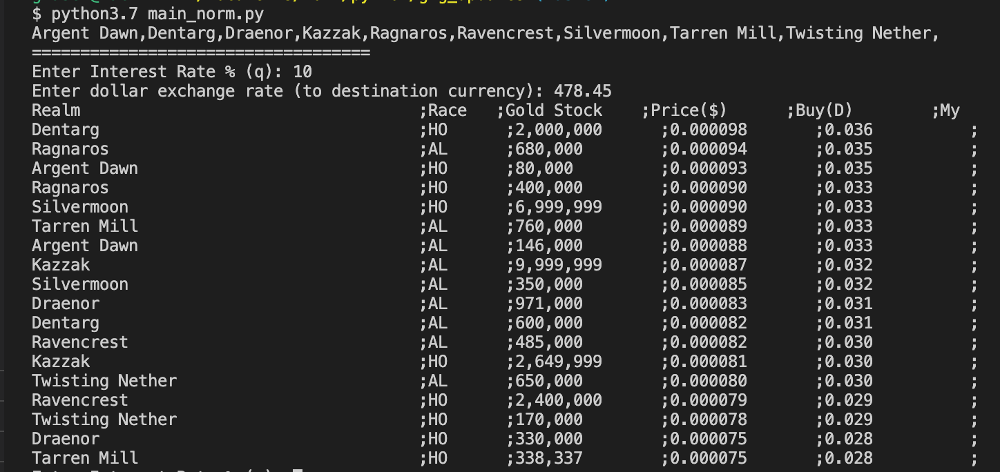

# fetch g2g cheapest orders
Are you a world of wacraft gold seller/buyer on g2g then using this script you are able to have your own sell/buy prices based on the cheapest orders on g2g in your desire currency plus your interest rate, you can also monitor if your orders are the cheapest one for the specific realm and faction!

## How to install & run
1. install python 3.7+
2. pip install bs4
3. for world of warcraft run: `python main_norm.py`
4. for wow classic run: `python main_classic.py`

## How to enable tracking for your orders
In wow_classic_fetch.py file, replace your username from g2g website with 'username' value (you need to keep single quote). 
if your orders are the cheapest one for the relam and fiction under 'my' column you can find a \* character!

## Sample output

## License
The contents of this repository are covered under the [MIT License](https://github.com/ghasemel/g2g-cheapest-orders-list/blob/master/LICENSE)
